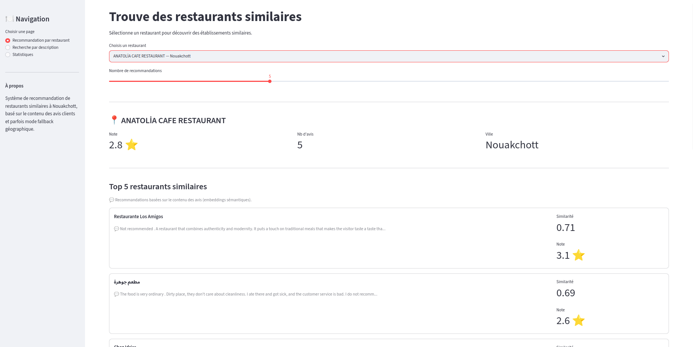
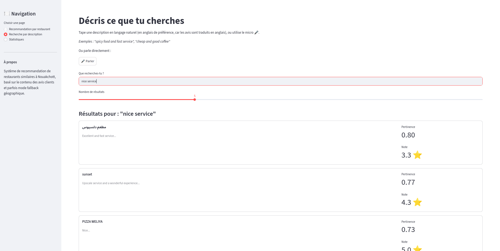
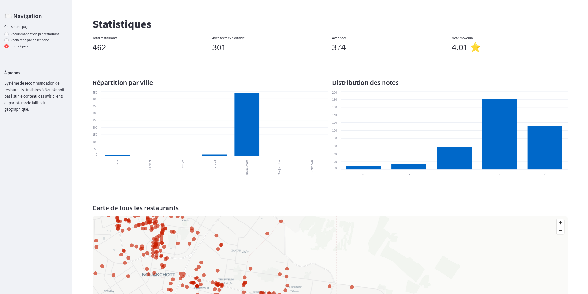

# Système de recommandation de restaurants similaires — Nouakchott

Projet réalisé dans le cadre du cours *Systèmes de recommandation*.

**Auteur :** Vatma El wavi
**Sujet :** Recommender de restaurants similaires

---

## 1. Problème

L'objectif de ce projet est de construire un système qui, à partir d'un
restaurant choisi par l'utilisateur, recommande des restaurants similaires à
Nouakchott (Mauritanie).

La notion de « similarité » n'est pas évidente à définir ici : le dataset ne
contient aucune catégorie de cuisine (pas de "pizzeria", "marocain",
"fast-food"...). La seule source d'information vraiment riche est le **texte
des avis clients**. Le problème devient donc : *comment déduire qu'un
restaurant ressemble à un autre uniquement à partir de ce que les clients en
disent ?*

Une contrainte supplémentaire complique le problème : tous les restaurants
n'ont pas d'avis textuels. Le système doit donc rester utile même quand
l'information principale (le texte) est absente.

## 2. Dataset

**Source :** `restaurants-mr-reviews.csv` — export de type Google Maps
Scraper (format Apify), 462 restaurants, 429 colonnes brutes.

**Format d'origine :** un restaurant par ligne, avec jusqu'à 10 avis
« dépliés » horizontalement (`reviews/0/...` à `reviews/9/...`). Ce format est
inexploitable directement pour du NLP et a nécessité une restructuration
complète (voir *Méthode*).

**Colonnes utiles retenues :** `title`, `city`, `location/lat`,
`location/lng`, `totalScore`, `reviewsCount`, plus le texte des avis
(`reviews/i/text` et `reviews/i/textTranslated`).

**Problèmes de qualité identifiés et traités :**

| Problème | Ampleur | Traitement |
|---|---|---|
| Notes manquantes (`totalScore`) | 88 restaurants (19%) | Confirmé : restaurants jamais notés (`reviewsCount = 0`), pas une erreur. Conservés et flagués (`has_rating`). |
| Villes incohérentes (variantes arabe/latin, fautes) | 14 valeurs distinctes pour ~6 vraies villes | Dictionnaire de normalisation manuel (`city_clean`). |
| Titres dupliqués | 2 cas (`"مطعم"`, `"منتجع الراحة"`) | Vérifiés comme établissements réellement différents (coordonnées GPS distinctes). Identifiant unique construit à partir de titre + coordonnées plutôt que titre seul. |
| Avis sans texte exploitable (emoji seul, vide) | 161 restaurants (35%) | Filtrés (longueur < 3 caractères après nettoyage). Ces restaurants basculent sur un mode de recommandation alternatif (voir *Méthode*). |
| Avis multilingues (arabe, français, anglais, +20 autres langues) | — | Utilisation prioritaire de `textTranslated` (déjà traduit en anglais par Google). |

## 3. Features utilisées

- **Texte des avis combinés** (`reviews_text_combined`) — feature principale,
  utilisée pour le content-based filtering. Nettoyée (suppression d'emojis,
  normalisation des espaces) et agrégée (tous les avis d'un restaurant
  fusionnés en un seul document).
- **Coordonnées GPS** (`lat`, `lng`) — utilisées en *fallback* pour les
  restaurants sans texte, et pour la carte interactive.
- **Note** (`rating_final`) — `totalScore` si disponible, sinon moyenne des
  notes individuelles des avis récupérés. Utilisée comme critère secondaire de
  tri dans le fallback géographique.
- **Ville normalisée** (`city_clean`) — affichage et désambiguïsation, pas
  utilisée directement dans le calcul de similarité.

## 4. Méthode

### 4.1 Vue d'ensemble du pipeline

```
Texte brut des avis (10 colonnes/restaurant)
        ↓ restructuration + nettoyage
Un seul texte combiné par restaurant
        ↓ vectorisation (embeddings sémantiques)
Vecteur numérique par restaurant (384 dimensions)
        ↓ similarité cosinus
Matrice de similarité restaurant × restaurant
        ↓ algorithme de recommandation
Top-N restaurants similaires (ou fallback géo si pas de texte)
```

### 4.2 Type de système

Système de recommandation **content-based filtering**, avec un mécanisme de
repli basé sur des règles (proximité géographique + note). Le choix du
content-based plutôt que du collaborative filtering est dicté par les données
disponibles : le dataset ne contient pas d'historique d'interactions
utilisateur × item identifiables, condition nécessaire au collaborative
filtering.

### 4.3 Vectorisation : embeddings sémantiques

Deux approches ont été implémentées et comparées au stade exploratoire du
notebook : **TF-IDF** (comptage de mots pondéré) et **embeddings sémantiques**
(modèle `paraphrase-multilingual-MiniLM-L12-v2`, sentence-transformers).

TF-IDF représente chaque restaurant par la fréquence pondérée des mots de ses
avis, en favorisant les mots qui le distinguent des autres. Sa limite : il ne
capte que le vocabulaire exact — deux avis exprimant la même idée avec des
mots différents ("delicious" / "tasty") ne sont pas reconnus comme proches.

Les embeddings représentent chaque restaurant par un vecteur dense capturant
le *sens* du texte plutôt que le vocabulaire exact. Le modèle a été choisi
pour son support multilingue, pertinent puisque des fragments d'avis restent
en arabe/français malgré la traduction automatique majoritaire.

**Décision finale : l'application utilise exclusivement les embeddings
sémantiques.** Cette décision repose sur trois observations faites pendant
l'évaluation (détaillées en section 6) : un score de similarité moyen
nettement supérieur à TF-IDF, un recouvrement nul entre les deux méthodes sur
les exemples testés (suggérant que TF-IDF manque des similarités réelles que
les embeddings captent), et la pertinence du support multilingue du modèle
choisi pour ce corpus. TF-IDF reste documenté dans le notebook à titre de
comparaison méthodologique, mais n'est plus utilisé dans l'application
finale.

### 4.4 Similarité

Calcul de la **similarité cosinus** entre tous les vecteurs d'embeddings des
301 restaurants disposant de texte exploitable, produisant une matrice de
similarité 301×301.

### 4.5 Algorithme de recommandation

Le système gère deux cas selon que le restaurant choisi dispose ou non d'avis
textuels exploitables.

**Cas 1 — Le restaurant a du texte (`content_based`).** L'algorithme
recherche la ligne du restaurant dans la matrice de similarité (embeddings),
trie les scores par ordre décroissant, exclut le restaurant lui-même puis
retourne les N restaurants restants les mieux notés.

| Restaurant testé : مقهى غيث Gaith coffee | Méthode utilisée : content based |
|-------------------------------------------|-----------------------------------|

| Title                     | Similarity score |
|---------------------------|------------------|
| Iloca 10002               | 0.822618         |
| Restaurant Amandine dit Malien | 0.738293    |
| Restaurant El Qouds       | 0.733160         |
| TEA TIME RESTAURANT       | 0.722803         |
| Cafeteria Taybe           | 0.715831         |

| مخبزة وحلويات الأولى (boulangerie) | 0.61 |

Les recommandations restent cohérentes avec le thème café/sucré/snack du
restaurant cible.

**Cas 2 — Le restaurant n'a pas de texte (`fallback_geo`).** Le système
calcule la distance réelle (formule de Haversine) vers tous les autres
restaurants, filtre ceux à plus de 10 km, puis trie par proximité puis par
note.

| Restaurant testé (sans texte) : Restaurant notre coin | Méthode utilisée : fallback_geo |
|-------------------------------------------------------|---------------------------------|

| Restaurant recommandé       | Distance | Note |
|-----------------------------|----------|------|
| منتجع اتريند (مطعم اتريند)  | 0.47 km  | 3.8  |
| مشروع كرمنا                 | 0.47 km  | 4.4  |
| Nkc meals                   | 0.48 km  | 3.1  |
| Fun haousse                 | 0.50 km  | Pas de note |
| مطعم التقليدي 2             | 0.50 km  | Pas de note |
— |

Toutes les recommandations sont à moins de 500 m, cohérent avec l'objectif du
fallback.

**Pourquoi cette approche hybride ?** Sans ce mécanisme de repli, 35% du
catalogue (161 restaurants) ne recevrait aucune recommandation. L'approche
garantit qu'un restaurant, qu'il ait des avis ou non, peut toujours servir de
point de départ.

### 4.6 Bonus — recherche par description libre (texte et vocal)

En complément de la recommandation « restaurant → restaurants similaires »,
l'application propose une recherche par description libre : l'utilisateur
tape (ou dicte au micro) une phrase comme *"spicy food and fast service"*,
qui est encodée par le même modèle d'embeddings que les restaurants, puis
comparée directement par similarité cosinus pour retrouver les
établissements dont les avis correspondent le mieux.

La saisie vocale utilise la *Web Speech API* du navigateur (composant
`streamlit-mic-recorder`) : la transcription se fait côté navigateur, sans
bibliothèque de reconnaissance vocale lourde côté serveur.

## 5. Captures d'écran

**Page « Recommandation par restaurant »**



**Page « Recherche par description » (texte et vocal)**



**Page « Statistiques »**



## 6. Évaluation

Le dataset ne contenant aucun historique d'interactions utilisateur (clics,
retours de pertinence sur des recommandations passées), les métriques
classiques de précision/rappel (précision@K, rappel@K, NDCG, MAP) ne sont pas
applicables : elles nécessitent une vérité terrain que ces données ne
fournissent pas. La note moyenne d'un restaurant (`totalScore`) ne peut pas
non plus servir de substitut : elle mesure la qualité perçue d'un
établissement, pas la pertinence d'une mise en relation entre deux
restaurants.

L'évaluation repose donc sur des indicateurs intrinsèques, ne nécessitant pas
de vérité terrain.

**Couverture du catalogue (content-based) :** 301/462 restaurants (65,2 %).
161 restaurants (34,8 %) ne disposent d'aucun avis textuel exploitable et
basculent sur le mode de recommandation par proximité géographique
(fallback). Cette métrique mesure la part du catalogue pour laquelle le
système exploite réellement le contenu des avis, plutôt que de se reposer sur
le repli géographique.

| Métrique (embeddings) | Score |
|---|---|
| Couverture du catalogue | 65,2 % (301/462) |
| Similarité moyenne des recommandations (top-5) | 0,667 |
| Écart-type | 0,097 |
| Similarité moyenne — baseline aléatoire | 0,355 |

**Lecture des résultats :**

- Comparé au score moyen obtenu avec les vraies recommandations (0,667), le
  baseline aléatoire (0,355) montre que le système produit des résultats
  sensiblement plus similaires que le hasard — un signe que la méthode
  capture un vrai signal sémantique dans les avis, plutôt que des
  associations fortuites. L'écart entre le score réel et le hasard est plus
  informatif que le score brut pris isolément : avec les embeddings, l'espace
  vectoriel tend à produire des similarités globalement plus élevées même
  entre documents non liés, car le modèle capture des régularités de
  structure de phrase communes à tous les avis (longueur, ton, vocabulaire
  général lié à la restauration).
- 34,8 % du catalogue (161 restaurants) n'ayant aucun avis textuel, le
  système bascule sur le fallback géographique, garantissant une
  recommandation pour 100 % du catalogue.

**Comparaison TF-IDF vs embeddings (étude exploratoire) :** sur 5 restaurants
testés en comparaison directe, le recouvrement entre les top-5 recommandés
par TF-IDF et par embeddings est de **0 restaurant en commun**, à chaque
fois. Ce résultat confirme que les deux méthodes ne mesurent pas la même
notion de similarité : TF-IDF identifie un vocabulaire exact partagé, les
embeddings identifient un sens proche indépendamment du vocabulaire. Un
recouvrement nul aussi systématique suggère une divergence structurelle
marquée entre les deux représentations sur ce corpus de taille modeste (avis
courts, vocabulaire varié après traduction automatique) ; un échantillon de
validation plus large serait nécessaire pour confirmer si cette tendance se
généralise à l'ensemble du catalogue.

**Évaluation qualitative :** sur les restaurants testés manuellement (cafés,
restaurants de viande grillée, pizzerias), les recommandations produites par
embeddings restent cohérentes avec le thème du restaurant cible.

## 7. Limites

- **Absence de vérité terrain.** Aucune métrique de précision/rappel
  classique n'a pu être calculée par manque de retours utilisateurs réels.
  Une évaluation rigoureuse nécessiterait de collecter des données d'usage
  (clics, notes de pertinence) après déploiement.
- **35 % du catalogue sans texte exploitable.** Pour ces restaurants, la
  recommandation repose uniquement sur la proximité géographique et la note,
  une méthode nettement moins riche que l'analyse de contenu.
- **19 % des restaurants sans aucune note.** Concerne en grande partie les
  mêmes établissements peu actifs sur Google Maps que ceux sans texte.
- **Traduction automatique imparfaite.** Le texte utilisé pour le NLP dépend
  de la traduction Google (`textTranslated`), dont la qualité varie selon la
  langue source — particulièrement pour les fragments restés en arabe.
- **Recherche vocale dépendante du navigateur.** La transcription utilise la
  Web Speech API, disponible sur Chrome mais pas sur Firefox, et nécessite
  une connexion internet (traitement non local).
- **Recouvrement nul entre TF-IDF et embeddings non pleinement expliqué.**
  L'écart observé est cohérent avec la différence de nature des deux
  méthodes, mais son caractère systématique (0/5 sur tous les exemples
  testés) n'a pas pu être expliqué en profondeur avec les outils de ce
  projet ; il pourrait être lié à la petite taille du corpus ou à la
  brièveté des avis.

## 8. Structure du projet

```
projet_sys_rec/
├── notebook_preprocessing.ipynb   # Nettoyage, vectorisation, algorithme, évaluation
├── app.py                          # Application Streamlit (3 pages)
├── recommender.py                 # Logique de recommandation, importée par app.py
├── restaurants_clean.csv          # Dataset nettoyé complet (462 restaurants)
├── restaurants_with_text.csv      # Sous-ensemble avec texte exploitable (301)
├── embeddings.npy                 # Embeddings bruts des avis (301 × 384)
├── embed_similarity_matrix.npy    # Matrice de similarité (embeddings)
├── captures
├────── page_recommandation.png
├────── page_chatbot.png
├────── page_statistiques.png
├── requirements.txt
├── README.md
```

## 9. Exécution

```bash
# Installer les dépendances
pip install -r requirements.txt

# Lancer l'application (depuis le dossier contenant app.py et les artefacts)
streamlit run app.py
```
